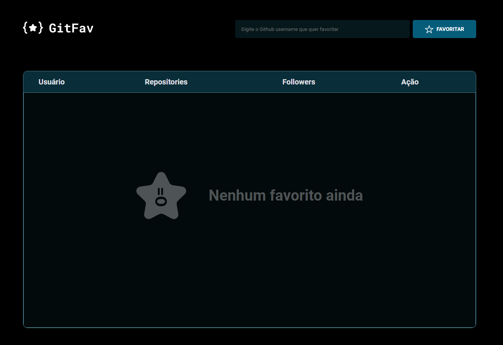
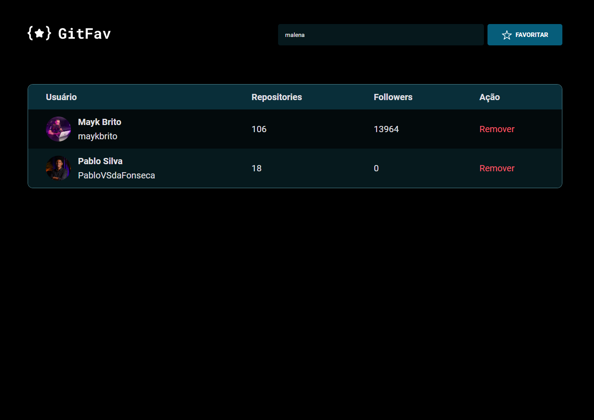

<h1 align="center"> GitFav </h1>

Aplicação desenvolvida no Stage 06 do programa Explorer da Rocketseat.

  <a href="#-tecnologias">Tecnologias</a>&nbsp;&nbsp;&nbsp;|&nbsp;&nbsp;&nbsp;
  <a href="#-projeto">Projeto</a>&nbsp;&nbsp;&nbsp;|&nbsp;&nbsp;&nbsp;
  <a href="#-layout">Layout</a>&nbsp;&nbsp;&nbsp;|&nbsp;&nbsp;&nbsp;
  <a href="#memo-licença">Licença</a>

  

 

  

  

## 🚀 Tecnologias

Esse projeto foi desenvolvido com as seguintes tecnologias:

- HTML e CSS
- JavaScript
- JSON
- Git e Github

## 💻 Projeto

Aplicação que permite o usuário criar uma lista de perfis favoritos do gitHub, exibindo informações como a quantidades de repositórios e seguidores do perfil adicionado. A página conta com funcionalidades de adicionar/remover perfis, direcionamento automático para o perfil adicionado, avisos de confirmação de remoção de perfil, perfis repetidos, bem como uma mensagem quando nenhum perfil se encontra adicionado. 

## 🔖 Layout

Você pode visualizar o layout do projeto através [DESSE LINK](<https://www.figma.com/file/mcGZzNF56EHyYc0KkhQ0lm/%5BDesafios-Explorer%5D-GitFav-(Copy)-(Copy)?type=design&node-id=104-48&mode=design&t=7W6pprwqFSWIRO4w-0>). É necessário ter conta no [Figma](https://figma.com) para acessá-lo.

## :memo: Licença

Esse projeto está sob a licença MIT.

---